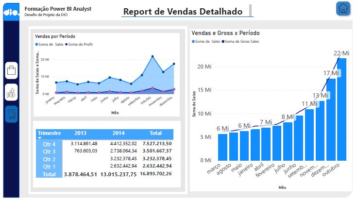

# 📊 Dashboard Financeiro com Foco em UX (Power BI)

Projeto desenvolvido como desafio prático da DIO com o objetivo de melhorar a experiência do usuário (UX) em um relatório financeiro no Power BI.

---

## 📊 Preview do Dashboard

  

---

## 🎯 Objetivo do Desafio

Modificar um relatório criativo previamente desenvolvido, aplicando conceitos de design e usabilidade para tornar a análise mais intuitiva, organizada e interativa.

Foram considerados os seguintes princípios:

- 📌 Posicionamento dos elementos  
- 🎨 Contraste visual  
- ⚖️ Proporção e equilíbrio (proporção áurea)  
- 🔎 Segmentação dos dados  

---

## 🛠️ O que foi desenvolvido

- Reestruturação do layout com foco em organização e clareza  
- Aplicação de hierarquia visual nos indicadores (KPIs)  
- Ajustes de cores para melhorar contraste e legibilidade  
- Criação de segmentações (filtros) para análise dinâmica  
- Padronização visual entre páginas do relatório  

---

## 🧭 Navegação e Interatividade

- Implementação de menu lateral com botões de navegação  
- Criação de 3 páginas interativas:
  - **Sales**
  - **Profit**
  - **Report**
- Destaque visual da página ativa (melhoria de UX)  
- Efeito de foco (hover) nos botões  
- Botão de navegação para a página inicial (Home)  

---

## 📊 Funcionalidades do Dashboard

- Análise de vendas por período  
- Análise de lucro por produto e segmento  
- Comparação temporal (trimestres e anos)  
- Visualizações interativas (gráficos e matriz)  
- Filtros por data e categorias  

---

## 🎨 Design e Experiência do Usuário

O projeto foi desenvolvido com foco em:

- Interface limpa e intuitiva  
- Navegação simples e clara  
- Destaque de informações relevantes  
- Consistência visual entre páginas  

---

## 🚀 Ferramentas Utilizadas

---

## 📌 Observações

Este projeto aplica boas práticas de UX e design em dashboards, combinando organização visual, interatividade e clareza na apresentação dos dados.

---

Projeto desenvolvido para fins de estudo e aprimoramento em análise de dados e construção de dashboards profissionais.
